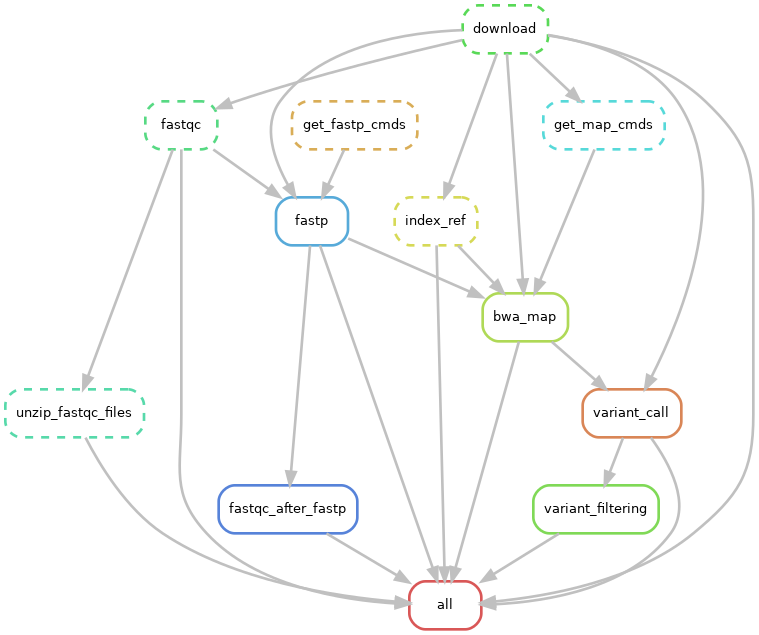

# THE NGS PIPELINE
This pipeline is a snakemake execution of a bioinformatics protocol to process FASQT files

**System requirements**
- Linux distribution
- Your favorite code editor (Visual Studio code, sublime text, Pycharm etc)
- snakemake version 8.10.0 or later. One of the errors experienced during development 
  **'PosixPath' object has no attribute 'startswith'** is due to an incompatible version of snakemake/python.
## File names and naming
- The desired file naming is _R1, _R2 for this pipeline. If your file naming do not conform to this, 
  the pipeline will rename the files to match this requirement.
## Reference genome
- For a better run, choose to work with a reference genome that requires to be downloaded. Make sure to include the link to the reference genome in the `links.txt` file
- If you have a reference genome, store it in the ref genome folder. Ensure that you only have one ref genome for each run, 
  otherwise the downstream analyses will fail.

# How to run the pipeline:
- With this version, clone this repository in your local environment

  `git clone https://github.com/GeOdette/NGS_pipeline.git`

- Next, install the necessary bioinformatics tools required for the pipeline. Use the `setup.sh` file at the base of the folder.

  `bash ./setup.sh`

- Alternatively, you can look at the requirements.txt file and install the tools manually
  
- Confirm that snakemake has been installed in your system by running `snakemake --version`. This should give you the latest version of snakemake.
  
- Before running this pipeline, this pipeline assumes that you have a list of links that you want to process.
  
- Ensure these links are stored in a file called `links.txt`
  
- This pipeline is developed using default settings. To enhance your run, edit the `config.yaml` file in the config directory to your desired needs.

## Running the pipeline
- To run the pipeline, use the following code:
- Ensure you activate your conda environment and have snakemake version 8 and above
- Change into the project directory. Specifically, **NGS_pipeline**

  `snakemake --profile config/`

- **NOTE:** The number of cores have been set in the config file. You can adjust that depending on you compute resources

# Tools executed by the pipeline

**This pipeline execute the following tools**

- `FASTQC` for quality checks/screening
  
- `FASTP` for quality control with an option to run trimmomatic
  
- `BWA` for alignment/genome mapping
  
- `SAMTOOLS` for sorting and indexing
  
- `BCFTOOLs` for variant calling with an option for freebayes
  
- `BAMTOOLS` for filtering and coverage

# Expected outputs

## The pipeline will generate a results folder with the following files:

- `results/data` folder with the fastq files
  
- `results/fastqc_output` folder containing the fastqc results. This folder also contains all_summary.txt file that contain summary statistics from all fastqc runs
  
- `results/ref` folder containing the reference genome
- `results/bam` folder containing bam files
- `results/trimmed` containing trimmed files
- `results/trimmed/fastqc_out` containing fastqc output of the trimmed files.
- `results/variants` containing files of filtered and unfiltered/raw vcfs

## Running into errors:
- If you run into an error that, eigther due to the bioinformatics tools use, consider restarting the pipeline again.
- The pipeline will pick from process you have not run. 
- **Errors can occur not due to the pipeline but sequence files used*.* In these isntances, be sure to correct the files and start the run.
- Delete files from any stage that failed. For instance, if you encounter an error in the fastqc step, delete files in this folder.
  While the pipeline aims to automatically delete such files, this might not always be the case.
- For each time you restart, delete the `temp` directory. The directory contains commands for running some of the pipeline processes.
  These commands might change with change in files. Failure to delete the `temp` directory might lead to wrong commands, hence additional errors.

## The config file
- You may edit the config file to include as many parameters as you want.

# THE DAG
